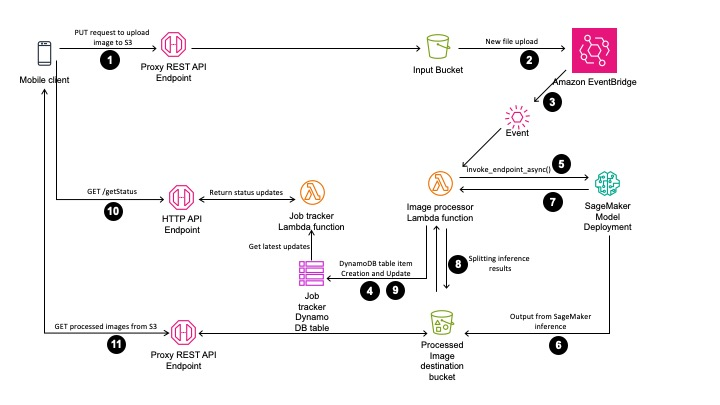

# aiconclave-demo-time-traveler


### Getting started

Make sure that you have cloned this repository. You can do this using intrictions from GitLab. Note that this code has been tested in __ap-south-1__ only.

### Add your files

Once you have cloned this repository. Please follow the below steps to set this demo up in your AWS account.
In the directory where you have cloned this repository:


`ls`


You should see 3 directories: `code`, `lambda_container`, `images` and `container`.


Next, download the PyTorch model file from this [Google drive location](https://drive.google.com/file/d/1ZILUGnwMyhrSYXaWnpFwzASVFt7ZXSSb/view?usp=drive_link) to the current working directory. 


The name of the file is `model.pt`. You can use [gdown](https://pypi.org/project/gdown/) to directly download the file, [these instructions](https://stackoverflow.com/questions/25010369/wget-curl-large-file-from-google-drive) might be useful. 


We are not training/fine-tuning this model. If you want to know more about this model you can find it in this paper [here](https://arxiv.org/pdf/2102.02754.pdf), additionally, we will be using Dlib for facial landmark detection, this article provides a good [intro to Dlib](https://towardsdatascience.com/facial-mapping-landmarks-with-dlib-python-160abcf7d672).


Place the above downloaded file at the same level as the directories `code`, `lambda_container`, `README.md` and `container` in the cloned repository, so your ls should show `model.pt`, apart from the previously mentioned directories. __Note__: If you have a `model.tar.gz` from previous runs of these commands, make sure you have deleted it using the following command: `rm model.tar.gz`.


Next, run the following command, in the same order as given below:

`tar czvf model.tar.gz ./code model.pt`

This will create the structure [described in this documentation](https://sagemaker.readthedocs.io/en/v2.32.1/frameworks/pytorch/using_pytorch.html#model-directory-structure). Looks like the below picture.


Once you have created the model artifacts i.e. model.tar.gz, upload it to your preferred Amazon S3 location. You can add additional prefixes if you like.


`aws s3 cp model.tar.gz s3://<Amazon S3 bucketname>/model.tar.gz` 

**NB: Your S3 bucket and key name may differ, but has to always end with `model.tar.gz`**


Now, change directory as shown below.


`cd container`


Execute the following command. You can change the name of the repository by making changes to the build_and_push.sh.


`./build_and_push.sh`


The previous command will create the ECR repo, and push the image to it for SageMaker to use later. Make a note of the ECR image URL from the previous command, you will need it later.


Now that we have our model artifacts and the container image ready. Let us deploy the model to a SageMaker endpoint.


### Model deployment


You should do this from a Jupyter Notebook. The following code in the notebook will ensure you deploy the model for this demo.

```
import boto3

aws_region="ap-south-1"

role = get_execution_role()

sagemaker_client = boto3.client("sagemaker", region_name=aws_region)

sagemaker_role= get_execution_role()
```

Set up the bucket and object key for the model artifacts.

```
#Create a variable w/ the model S3 URI
s3_bucket = 'my_demo_bucket' # Provide the name of your S3 bucket
bucket_prefix=''
model_s3_key = f"model.tar.gz"

#Specify S3 bucket w/ model
model_url = f"s3://{s3_bucket}/{model_s3_key}"
```

You created your inference container a few steps back, set that up.

`container = "111111111111.dkr.ecr.ap-south-1.amazonaws.com/my_repo:latest"`

We will be going for an asynchronous endpoint, because we aren't sure how long our model might take.

```
model_name = 'model-name'

#Create model
create_model_response = sagemaker_client.create_model(
    ModelName = model_name,
    ExecutionRoleArn = sagemaker_role,
    PrimaryContainer = {
        'Image': container,
        'ModelDataUrl': model_url,
        'Environment':{
            'TS_MAX_REQUEST_SIZE': '100000000',
            'TS_MAX_RESPONSE_SIZE': '100000000',
            'TS_DEFAULT_RESPONSE_TIMEOUT': '1000'
        },
    })
```

Create an endpoint configuration. I have removed all the optional parts from the code below.

```
s3_bucket_new = 'my-demo-bucket-output' ## output bucket
endpoint_name = 'my-demo-endpoint'
endpoint_config_name = "my-demo-config-name"

create_endpoint_config_response = sagemaker_client.create_endpoint_config(
    EndpointConfigName=endpoint_config_name, # You will specify this name in a CreateEndpoint request.
    # List of ProductionVariant objects, one for each model that you want to host at this endpoint.
    ProductionVariants=[
        {
            "VariantName": "variant1", # The name of the production variant.
            "ModelName": model_name, 
            "InstanceType": "ml.g4dn.xlarge", # Specify the compute instance type.
            "InitialInstanceCount": 1 # Number of instances to launch initially.
        }
    ],
    AsyncInferenceConfig={
        "OutputConfig": {
            # Location to upload response outputs when no location is provided in the request.
            "S3OutputPath": f"s3://{s3_bucket_new}/output",
        },
        "ClientConfig": {
            # (Optional) Specify the max number of inflight invocations per instance
            # If no value is provided, Amazon SageMaker will choose an optimal value for you
            "MaxConcurrentInvocationsPerInstance": 4
        }
    }
)
```

Create your endpoint.

```
create_endpoint_response = sagemaker_client.create_endpoint(
                                            EndpointName=endpoint_name, 
                                            EndpointConfigName=endpoint_config_name)
```

The endpoint creation might take some time, but it will eventually get done. Your model is now ready for inference requests.

Invoke the model using this code,

```
# Create a low-level client representing Amazon SageMaker Runtime
sagemaker_runtime = boto3.client("sagemaker-runtime", region_name="ap-south-1")

# Specify the location of the input. Here, a single JPEG file. Note that SageMaker should have access to the S3 location.
# Check the Sagemaker execution role to ensure it can access S3.
input_location = "s3://my-image-bucket/input/Test-Picture-Of-A-Face.jpg"

# After you deploy a model into production using SageMaker hosting 
# services, your client applications use this API to get inferences 
# from the model hosted at the specified endpoint.
response = sagemaker_runtime.invoke_endpoint_async(
                            EndpointName=endpoint_name, 
                            ContentType='image/jpeg',
                            Accept='application/x-npy',
                            InputLocation=input_location,
                            InvocationTimeoutSeconds=900)`
```

You will find the model output serialized at the location which you can find in the `response` to the `invoke_endpoint_async` call. You can find it in `response["OutputLocation"]`. You can isolate the S3 bucket (which you already have) and the key to download the inference results using the code below, replace with your own specific values.

```
import botocore.exceptions

s3 = boto3.client('s3')
try:
    resp = s3.download_file(s3_bucket_new,'somefolder_prefix/some_object_key','local_filename')
except Exception as e:
    pprint(e)`
```

To test the model's inference capability, try the code below. This function displayes the specific image you want as the output of the cell where you call it. In the current setup and based on the current inference code, we get 5 images back, the first is the original image, and the rest from subscript 1 to 4 are part of the inference process.

```
from PIL import Image
import numpy as np

results = np.load(f"local_filename")

def showSpecificImage(image_number,images_array):
    '''image_numbers start from 0, 
    where image_number == 0 is the original, 
    photographed image'''
    if int(images_array.shape[1]/images_array.shape[0]) <= image_number:
        print("Invalid image id requested.")
        return
    if image_number == 0:
        starting_point = 0
        end_point = (starting_point + 1)*1024
    else:
        starting_point = image_number*1024
        end_point = starting_point+1024
    img = Image.fromarray(images_array[:,starting_point:end_point,:])
    img.show()

showSpecificImage(2,results)
```

All of the above code and a lot of experiments are present in the Jupyter Notebook available in this repository **inference-test-NB-Working.ipynb**.



### How the demo works

Please refer to the diagram above and the explanation for the corresponding numbered steps below:

1. A client makes a __PUT__ request to an REST API endpoint to upload an image file to the S3 input bucket.

2. This generates an __event__.

3. The __event__ is delivered to Lambda, which results in an invocation of the image processor lambda function.

4. The image processor updates a Job tracker table in DynamoDB. This update indicates that the image is being processed.

5. The input location from the __event__ is used to invoke the SageMaker model endpoint.

6. The SageMaker model processes the inference request and uploads the results to a destination bucket.

7. Once the results are uploaded to the destination bucket, the model endpoint sends a response back to the image processor Lambda function.

8. The Lambda function downloads the results from the destination bucket and further runs a split on the results. After the split, it uploads the results of the split process back to the destination S3 location.

9. Image processor lambda function updates the specific item with the completion status of the request.

10. The client, after having __PUT__ the input image on S3 for processing, retries by sending __GET__ to the Jobtracker lambda function through an HTTP API endpoint. The Job tracker checks for completion of the image processing and sends the current status at every request. This step completes when the API returns a __SUCCESS__ status.

11. The client makes a __GET__ request to another REST API endpoint to get the processed image results.

## Demo component details, configuration and code

This section details the configurations of every component that we use in this demo.

### Proxy API for uploading input files to S3

The REST API for uploading files to Amazon S3 is set up as a proxy to the S3 input location. The entire URL to the input image object is passed in to the `invoke_endpoint_async()` call. You can get more information about setting up such proxy REST API endpoints [here](https://docs.aws.amazon.com/apigateway/latest/developerguide/integrating-api-with-aws-services-s3.html).

### Image processing lambda function

The lambda function is triggered by the S3 FileUpload event. The function prepares for the call to the SageMaker endpoint. On receiving the results of the inference. The function downloads the results, splits the result into individual images and uploads it to the destination S3 location. During the processing it also updates a DynamoDB table that is used to keep track of the status of the image processing jobs.

Due to the fact that there are many dependencies, we use an image to deploy the lambda, and the `lambda_container` directory in this repo is all you need to deploy it. You can find in-depth information about Lambda container deployments [here](https://docs.aws.amazon.com/lambda/latest/dg/images-create.html).

### Job tracking 

This has three components, an HTTP API endpoint, an AWS Lambda function and a DynamoDB table.

#### The HTTP endpoint

This is simply an HTTP API endpoint that has a lambda integration. You can learn more about setting such an endpoint up [here](https://docs.aws.amazon.com/apigateway/latest/developerguide/http-api-develop-integrations-lambda.html).

#### The lambda function

This function is triggered by a call to the HTTP API endpoint. It uses a request id key to check if a specific image processing job is complete. If it is, it returns __SUCCESS__ with an __HTTP 200 OK__ code. Along with this, it also sends back metadata about the resulting image files. the metadata is of the from, this is only a sample:

```
{
    'statusCode': 200, 
    'body': {
        'Metadata': '{
            "Results": [
                {
                    "Filename": "SomeName_0.jpg", 
                    "AgeRange": "ORIGINAL"
                }, 
                {
                    "Filename": "SomeName_1.jpg", 
                    "AgeRange": "5-10"
                }, 
                {
                    "Filename": "SomeName_2.jpg", 
                    "AgeRange": "10-18"
                }, 
                {
                    "Filename": "SomeName_3.jpg", 
                    "AgeRange": "45-55"
                }, 
                {
                    "Filename": "SomeName_4.jpg", 
                    "AgeRange": "90-100"
                }
            ]
        }', 
        'Status': 'SUCCESS'
    }
}
```

On the other hand, if the image hasn't been processed, the function returns an HTTP status code of __200 OK__ and a __Status__ value of __INPROGRESS__.

For the purposes of this demo the Lambda function was written directly in the management console. For the record, providing the code listing for the function below.

```
import json
import boto3

DYNAMODBTABLE='AgeProcessingJob'

def lambda_handler(event, context):
    ### Get the RequestId from the event
    reqid = event['queryStringParameters']['RequestId']
    dynamodb = boto3.client('dynamodb')
    response = dynamodb.query(
        ExpressionAttributeValues={
            ':v1': {
                'S': reqid,
            },
        },
        KeyConditionExpression='RequestId = :v1',
        ProjectionExpression='CompletionStatus',
        TableName='AgeProcessingJob'
    )
    if response['Items'][0]['CompletionStatus']['N'] == '1':
        imageData = {
            "Results": [
                {
                    "Filename": reqid + "_0.jpg",
                    "AgeRange": "ORIGINAL"
                },
                {
                    "Filename": reqid + "_1.jpg",
                    "AgeRange": "5-10"
                },
                {
                    "Filename": reqid + "_2.jpg",
                    "AgeRange": "10-18"
                },
                {
                    "Filename": reqid + "_3.jpg",
                    "AgeRange": "45-55"
                },
                {
                    "Filename": reqid + "_4.jpg",
                    "AgeRange": "90-100"
                }
            ]
        }
        responseDict = {"statusCode": 200, "body": {"Metadata": json.dumps(imageData), "Status": "SUCCESS"}}
        return json.dumps(responseDict)
    else:
        return "{'statusCode': 200, 'body': {'Status': 'INPROGRESS'}}"
```

#### The DynamoDB table

This is simple on-demand provisioned table and is simply used to store `requestid`'s and `CompletionStatus` of the image processing job. `0` (zero) represents an in-progress job and `1`(one) represents a completed job.

### Image retrieval

Finally, images can be retrieved using a REST API endpoint with only the __GET__ method available. This proxy endpoint retrieves the file from the destination S3 location that the image processing lambda function (mentioned above) uploads them to.

